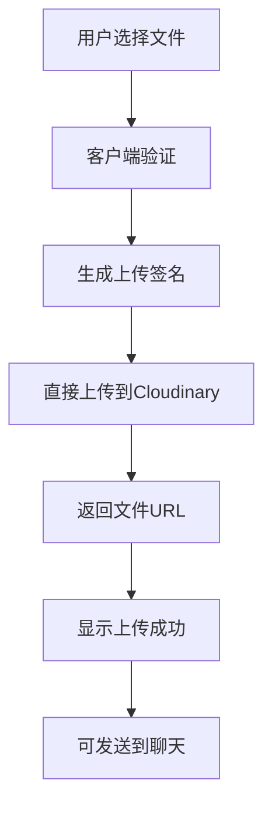

# 🚀 Cloudinary文件上传配置指南

## 📋 **为什么选择Cloudinary**

### 优势对比
| 特性 | Cloudinary | Firebase Storage | Uploadcare |
|------|------------|------------------|------------|
| 免费额度 | 25GB存储+流量 | 5GB存储+1GB流量 | 3GB存储+3GB流量 |
| 文件类型 | 全支持 | 全支持 | 全支持 |
| CDN加速 | ✅ 全球CDN | ✅ Google CDN | ✅ 全球CDN |
| 图片优化 | ✅ 自动优化 | ❌ 需手动 | ✅ 自动优化 |
| API易用性 | ⭐⭐⭐⭐⭐ | ⭐⭐⭐⭐ | ⭐⭐⭐⭐ |
| 客户端上传 | ✅ 支持 | ✅ 支持 | ✅ 支持 |

**选择Cloudinary的原因：**
- 免费额度最丰富，适合中小型项目
- 强大的图片/视频处理能力
- 简单易用的API，无需复杂配置
- 企业级稳定性和安全性

## 🔧 **注册和配置步骤**

### 1. 注册Cloudinary账号

1. **访问官网**：https://cloudinary.com
2. **点击注册**：选择"Sign up for free"
3. **填写信息**：
   - Email：你的邮箱地址
   - Password：设置密码
   - Company/Project：选择"Developer"或填写项目名
4. **验证邮箱**：检查邮箱并点击验证链接
5. **完成注册**：进入Dashboard

### 2. 获取API配置信息

登录后在Dashboard页面找到"Account Details"部分：

```
Product Environment Credentials
Cloud name: your_cloud_name
API Key: 123456789012345
API Secret: abcdefghijklmnopqrstuvwxyz123456
```

### 3. 配置环境变量

在项目根目录创建`.env.local`文件：

```env
# Cloudinary配置
NEXT_PUBLIC_CLOUDINARY_CLOUD_NAME=your_cloud_name
NEXT_PUBLIC_CLOUDINARY_API_KEY=123456789012345
CLOUDINARY_API_SECRET=abcdefghijklmnopqrstuvwxyz123456
```

**⚠️ 重要提示：**
- `NEXT_PUBLIC_`前缀的变量会暴露给客户端
- `CLOUDINARY_API_SECRET`不要加`NEXT_PUBLIC_`前缀，保持服务端私密

### 4. 验证配置

重启开发服务器：
```bash
npm run dev
```

检查控制台是否有配置错误。

## 🛠 **功能实现详解**

### 1. 文件上传流程



### 2. 安全机制

- **签名上传**：使用服务端生成的签名确保安全
- **文件验证**：客户端和服务端双重验证
- **类型限制**：只允许指定类型的文件上传
- **大小限制**：不同文件类型有不同的大小限制

### 3. 支持的文件类型

| 类型 | 格式 | 最大大小 | 用途 |
|------|------|----------|------|
| 图片 | jpg, png, gif, webp, svg | 10MB | 图片分享、截图 |
| 文档 | pdf, doc, docx, txt, md | 50MB | 文档分享 |
| 视频 | mp4, avi, mov, wmv | 100MB | 视频分享 |
| 音频 | mp3, wav, ogg, m4a | 20MB | 音频分享 |

## 🎯 **使用方法**

### 1. 上传文件
1. 点击聊天输入框的📎附件按钮
2. 选择文件或拖拽文件到上传区域
3. 等待上传完成（显示进度条）
4. 上传成功后显示文件信息

### 2. 发送文件到聊天
1. 上传完成后，点击文件旁的发送按钮🚀
2. 文件链接自动发送到聊天
3. 其他用户可以点击链接查看/下载文件

### 3. 管理文件
- **复制链接**：点击📋按钮复制文件URL
- **删除文件**：点击❌按钮从列表中移除
- **预览图片**：图片文件自动显示缩略图

## 🔒 **安全最佳实践**

### 1. 环境变量安全
```bash
# ✅ 正确：API Secret保持私密
CLOUDINARY_API_SECRET=your_secret

# ❌ 错误：不要暴露API Secret
NEXT_PUBLIC_CLOUDINARY_API_SECRET=your_secret
```

### 2. 文件验证
- 客户端验证文件类型和大小
- 服务端生成安全签名
- Cloudinary自动扫描恶意文件

### 3. 访问控制
- 上传的文件默认公开访问
- 可以配置私有访问（需要额外配置）
- 支持设置访问权限和过期时间

## 🚨 **常见问题解决**

### 1. 上传失败
**问题**：文件上传时显示错误
**解决方案**：
- 检查环境变量是否正确配置
- 确认文件大小和类型符合限制
- 检查网络连接是否正常
- 查看浏览器控制台错误信息

### 2. 签名错误
**问题**：提示"Invalid signature"
**解决方案**：
- 检查`CLOUDINARY_API_SECRET`是否正确
- 确认时间戳生成正确
- 重启开发服务器

### 3. 配置错误
**问题**：找不到Cloud Name或API Key
**解决方案**：
- 登录Cloudinary Dashboard
- 在Account Details中查看正确的配置信息
- 确保复制时没有多余的空格

### 4. 免费额度用完
**问题**：上传失败，提示额度不足
**解决方案**：
- 查看Cloudinary Dashboard的使用情况
- 删除不需要的文件释放空间
- 考虑升级到付费计划

## 📊 **监控和管理**

### 1. 使用情况监控
在Cloudinary Dashboard可以查看：
- 存储使用量
- 流量使用量
- 转换次数
- API调用次数

### 2. 文件管理
- **Media Library**：查看所有上传的文件
- **文件夹组织**：按项目或日期组织文件
- **批量操作**：批量删除或移动文件
- **搜索功能**：按文件名或标签搜索

### 3. 性能优化
- **自动优化**：Cloudinary自动优化图片质量和格式
- **CDN加速**：全球CDN确保快速访问
- **懒加载**：支持图片懒加载
- **响应式图片**：自动生成不同尺寸的图片

## 🎉 **完成！**

现在您的LangChain Chat应用已经具备了完整的文件上传功能：

- ✅ 真实的Cloudinary文件上传
- ✅ 支持多种文件类型
- ✅ 安全的签名上传机制
- ✅ 完整的进度显示和错误处理
- ✅ 文件发送到聊天功能
- ✅ 复制链接和文件管理

用户现在可以轻松上传和分享各种类型的文件，让聊天体验更加丰富！🚀
