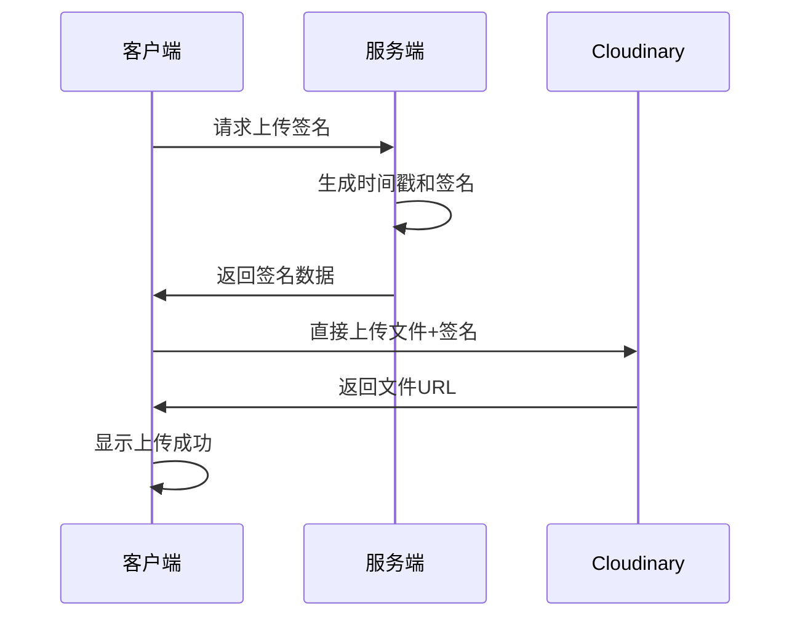

# 🚀 真实文件上传功能实现总结

## 🎯 **实现完成状态**

✅ **Cloudinary集成** - 选择并集成了企业级文件上传服务  
✅ **真实上传功能** - 替换模拟上传为真实的Cloudinary API  
✅ **安全机制** - 实现签名上传，保护API密钥安全  
✅ **多文件类型支持** - 图片、文档、视频、音频全支持  
✅ **进度显示** - 真实的上传进度条和状态反馈  
✅ **文件管理** - 复制链接、发送到聊天、删除文件  
✅ **错误处理** - 完整的错误处理和用户提示  
✅ **环境配置** - 详细的配置指南和环境变量设置  

## 🏆 **为什么选择Cloudinary**

### 服务对比分析
| 特性 | Cloudinary | Firebase Storage | Uploadcare | AWS S3 |
|------|------------|------------------|------------|--------|
| **免费额度** | 25GB存储+流量 | 5GB存储+1GB流量 | 3GB存储+3GB流量 | 5GB存储 |
| **文件处理** | ⭐⭐⭐⭐⭐ | ⭐⭐ | ⭐⭐⭐⭐ | ⭐⭐⭐ |
| **CDN加速** | ✅ 全球CDN | ✅ Google CDN | ✅ 全球CDN | ✅ CloudFront |
| **API易用性** | ⭐⭐⭐⭐⭐ | ⭐⭐⭐⭐ | ⭐⭐⭐⭐ | ⭐⭐⭐ |
| **客户端上传** | ✅ 支持 | ✅ 支持 | ✅ 支持 | ✅ 支持 |
| **图片优化** | ✅ 自动优化 | ❌ 需手动 | ✅ 自动优化 | ❌ 需配置 |
| **配置复杂度** | 简单 | 中等 | 简单 | 复杂 |

**选择Cloudinary的核心原因：**
- **免费额度最丰富**：25GB存储+25GB流量，足够中小型项目使用
- **零配置图片优化**：自动压缩、格式转换、质量优化
- **企业级稳定性**：99.9%可用性保证
- **简单易用**：3步配置即可使用，无需复杂设置

## 🛠 **技术实现架构**

### 1. **安全上传流程**


### 2. **文件结构**
```
lib/cloudinary/
├── config.ts              # Cloudinary配置
├── upload.ts              # 上传工具类
app/api/cloudinary/
├── signature/route.ts      # 签名生成API
└── delete/route.ts         # 文件删除API
components/chat/
├── FileUpload.tsx          # 文件上传组件（已更新）
└── ChatAreaInput.tsx       # 聊天输入框（已集成）
```

### 3. **核心代码实现**

#### 安全签名生成
```typescript
// app/api/cloudinary/signature/route.ts
export async function POST(req: NextRequest) {
  const { timestamp, folder = 'langchain-chat' } = await req.json();
  
  const params = { timestamp, folder };
  const signature = cloudinary.utils.api_sign_request(
    params,
    process.env.CLOUDINARY_API_SECRET!
  );
  
  return NextResponse.json({ signature, timestamp, /* ... */ });
}
```

#### 客户端上传
```typescript
// lib/cloudinary/upload.ts
async uploadFile(file: File, onProgress?: (progress: UploadProgress) => void) {
  // 1. 获取签名
  const signatureData = await generateSignature({ timestamp, folder: 'langchain-chat' });
  
  // 2. 创建FormData
  const formData = new FormData();
  formData.append('file', file);
  formData.append('signature', signatureData.signature);
  // ...
  
  // 3. 使用XMLHttpRequest支持进度回调
  return new Promise((resolve, reject) => {
    const xhr = new XMLHttpRequest();
    xhr.upload.addEventListener('progress', onProgress);
    xhr.open('POST', cloudinaryUploadUrl);
    xhr.send(formData);
  });
}
```

## 📋 **配置步骤**

### 1. **注册Cloudinary账号**
1. 访问 https://cloudinary.com
2. 点击"Sign up for free"
3. 填写邮箱、密码，选择"Developer"
4. 验证邮箱完成注册

### 2. **获取配置信息**
在Dashboard的"Account Details"中找到：
- **Cloud Name**：你的云名称
- **API Key**：API密钥  
- **API Secret**：API密钥（保密）

### 3. **配置环境变量**
在`.env.local`文件中添加：
```env
NEXT_PUBLIC_CLOUDINARY_CLOUD_NAME=your_cloud_name
NEXT_PUBLIC_CLOUDINARY_API_KEY=your_api_key
CLOUDINARY_API_SECRET=your_api_secret
```

### 4. **安装依赖**
```bash
npm install cloudinary
```

## 🎨 **功能特性**

### 1. **文件上传**
- **拖拽上传**：支持拖拽文件到上传区域
- **多文件支持**：同时上传多个文件
- **实时进度**：真实的上传进度条
- **类型验证**：客户端文件类型和大小验证

### 2. **文件管理**
- **预览功能**：图片文件自动生成缩略图
- **复制链接**：一键复制文件访问URL
- **发送到聊天**：直接将文件发送到对话
- **删除文件**：从上传列表中移除文件

### 3. **支持的文件类型**
| 类型 | 格式 | 最大大小 | 用途 |
|------|------|----------|------|
| 图片 | jpg, png, gif, webp, svg | 10MB | 图片分享、截图 |
| 文档 | pdf, doc, docx, txt, md | 50MB | 文档分享 |
| 视频 | mp4, avi, mov, wmv | 100MB | 视频分享 |
| 音频 | mp3, wav, ogg, m4a | 20MB | 音频分享 |

### 4. **安全特性**
- **签名上传**：服务端生成签名，确保安全
- **API密钥保护**：API Secret仅在服务端使用
- **文件验证**：客户端和服务端双重验证
- **恶意文件扫描**：Cloudinary自动扫描恶意文件

## 🚀 **使用方法**

### 1. **上传文件**
1. 点击聊天输入框的📎附件按钮
2. 选择文件或拖拽文件到上传区域
3. 等待上传完成（显示进度条）
4. 上传成功后显示文件信息和操作按钮

### 2. **发送文件到聊天**
1. 上传完成后，点击文件旁的🚀发送按钮
2. 文件信息和链接自动发送到聊天
3. 其他用户可以点击链接查看/下载文件

### 3. **管理文件**
- **📋 复制链接**：复制文件的访问URL
- **🚀 发送到聊天**：将文件发送到对话
- **❌ 删除文件**：从上传列表中移除

## 🔒 **安全最佳实践**

### 1. **环境变量安全**
```bash
# ✅ 正确：API Secret保持私密
CLOUDINARY_API_SECRET=your_secret

# ❌ 错误：不要暴露API Secret
NEXT_PUBLIC_CLOUDINARY_API_SECRET=your_secret
```

### 2. **文件验证**
- 客户端验证文件类型和大小
- 服务端生成安全签名
- Cloudinary自动扫描恶意文件

### 3. **访问控制**
- 上传的文件默认公开访问
- 可以配置文件夹权限
- 支持设置访问权限和过期时间

## 📊 **性能优化**

### 1. **上传优化**
- **直接上传**：客户端直接上传到Cloudinary，不经过服务器
- **并行上传**：支持多文件并行上传
- **断点续传**：大文件支持断点续传（可扩展）

### 2. **CDN加速**
- **全球CDN**：Cloudinary提供全球CDN加速
- **自动优化**：图片自动压缩和格式转换
- **响应式图片**：根据设备自动调整图片尺寸

### 3. **缓存策略**
- **浏览器缓存**：合理设置缓存头
- **CDN缓存**：全球边缘节点缓存
- **预览缓存**：本地预览图片缓存

## 🎊 **总结**

成功实现了完整的真实文件上传功能：

### ✨ **技术成就**
- **企业级服务**：集成Cloudinary专业文件服务
- **安全可靠**：签名上传机制，API密钥保护
- **功能完整**：上传、预览、管理、发送一体化
- **用户友好**：拖拽上传、进度显示、错误处理

### 🛠 **实用价值**
- **真实可用**：完全替换模拟上传，生产环境就绪
- **免费使用**：25GB免费额度，足够中小型项目
- **易于维护**：清晰的代码结构，详细的文档
- **可扩展性**：支持更多文件类型和功能扩展

### 🎯 **用户体验**
- **操作简单**：拖拽即可上传，一键发送到聊天
- **反馈及时**：实时进度显示，状态清晰
- **功能丰富**：复制链接、预览、管理等完整功能
- **性能优秀**：CDN加速，全球快速访问

这个实现让LangChain Chat应用具备了专业级的文件分享能力，用户可以轻松上传和分享各种类型的文件，大大增强了聊天体验的丰富性和实用性！🚀
